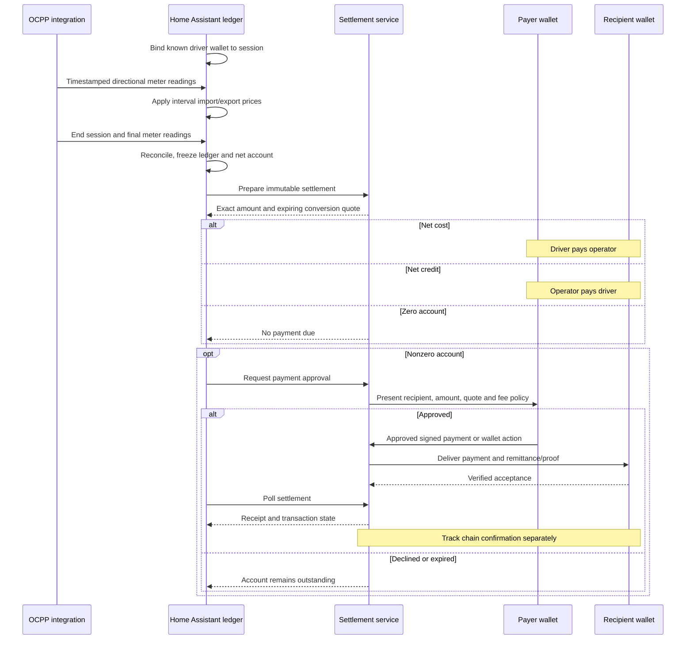
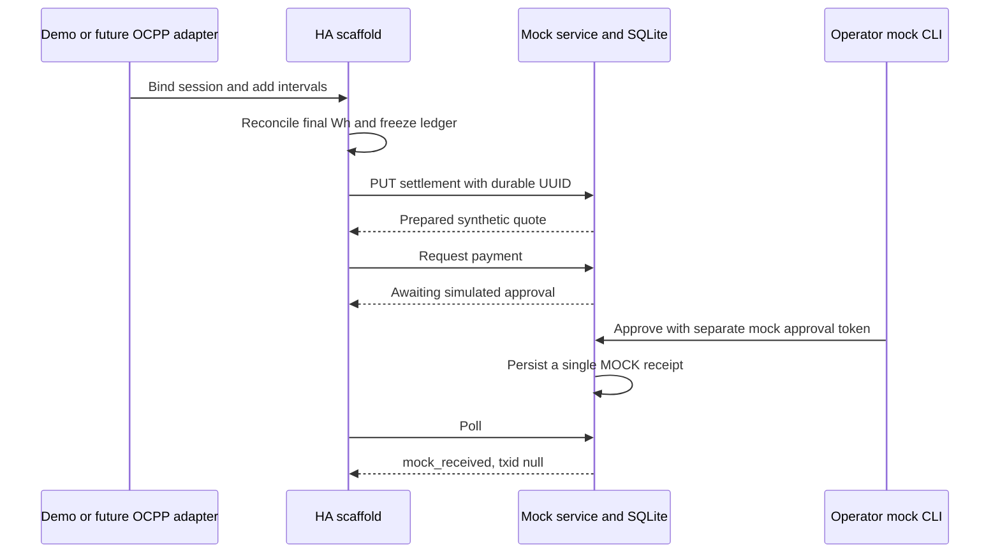

# Session-end wallet settlement

Current design | 2 October 2026

No budget is approved or reserved, and no payment gate is added to charging start. Home Assistant prices the actual session and the payer approves the final payment.

## Target flow

The sequence is a proposed logical exchange, not a claim that every selected wallet exposes the same transport. The eventual adapter must verify approval, submission, receipt and recovery capabilities.

## What v0.1.0 actually runs

No private key, real wallet signature, BSV transaction, chain confirmation or physical charger operation occurs in this mock. An operator credit is funded only conceptually until a live wallet adapter is implemented.
